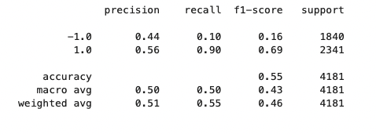

# ML Alg Trading Strategies
FinTech Challenge 14  
See full implementation and notebook details in [machine_learning_trading_bot.ipynb](app/machine_learning_trading_bot.ipynb)  

---

## Overview Of Analysis

Improving algorithmic trading systems by enhancing existing trading signals with ML algorithms.  

At a high-level, the following will be performed:  
- implement an algorithmic trading strategy that uses machine learning to automate trade decisions
- adjust input parameters to optimize the trading algorithm
- train a new machine learning model and compare its performance to that of a baseline model
- create an evaluation report that compares performance of each enhancement/model  

See full implementation and notebook details in [machine_learning_trading_bot.ipynb](app/machine_learning_trading_bot.ipynb)  

---  

## DataSet Details  

Data sets used to anlyze this space:
- [emerging_markets_ohlcv.csv](data/emerging_markets_ohlcv.csv) OHLCV data for an [MSCI-based emerging markets ETF](https://www.ishares.com/us/products/268704/ishares-currency-hedged-msci-emerging-markets) from iShares
    - contains data: `date | open | high | low | close | volume` from Jan 21, 2015 -> Jan 27, 2015 in 15-min intervals  

---  

## Model Performance Evaluation Report

### Baseline Algorithm Performance
A baseline performance was established by selecting initial training periods, and SMA short/long windows for the training and SMA windows.

#### Baseline Training Data Period
The baseline X_train and y_train data was sliced from a three-month period beginning on `2015-04-02` and ending on `2015-07-02`.  

#### Baseline SMA Windows
The baseline SMA short(fast) window was `4` days.
The baseline SMA long(slow) window was `100` days.  

#### Baseline Classifier
The baseline model used the [SVC classifier](https://scikit-learn.org/stable/modules/generated/sklearn.svm.SVC.html) from sklearn. To fit the training data and make predictions against the test data set.

#### Baseline Report
THe baseline model had a `0.55` accuracy, with a recall of `0.96` for the `1.0` classification, and a recall of `0.04` for the `-1.0` classification. See chart below. Note that the algorithmic trading strategy did outperform the actual returns.  

**Baseline Performance vs Actual Returns**  

  

### Adjusting ML Model Parameters
The model was re-fit with varying training data sizes, and SMA short/long windows to see if better performance could be achieved. In each case the same [SVC classifier](https://scikit-learn.org/stable/modules/generated/sklearn.svm.SVC.html) was used as before, and the model classification report and plot were generated to help compare performance results.  

#### Increasing/Decreasing Training Data Windows
The training data winwdow was increased to a 6month time-period, and also decreased to a 1 month time period. The SMA short long was held constant at 4/100 (short/long). Note that increasing the training window improved cumulative returns for the algorithmic strategy, to nearly `1.8`, while shortening the window lowered the cumulative returns to approximately `1.3`. Increasing the training data was an improvement.  

**6mos Training Data**  


**1mos Training Data**  


#### Increasing/Decreasing SMA Short/Long Rolling Windows
The SMA short/long feature parameters were tuned using values of 10/60(short/long) and 8/75(short/long), with training data periods of 1 month and 2 months respectively. The 10/60 SMA resulted in cumulative returns of about `1.5`, while the 08/75 SMA underperformed the acutal data.  

**1mo Training Data, 10/60 SMA**  



**2mo Training Data, 08/75 SMA**  


### ML Model Parameter Tuning Performance Conclusions

Looking at the various tuning experiments above, note that 3 of the 4 experiements resulted in model results which outperformed the `Actual Returns`. However, the tuning experiment which used 6mos of training data and the 4/100 short/long SMA rolling windows was the winner, with the largest cumulative returns of nearly `1.8` and accuracy of `0.56`.


## New LogisticRegression Machine Learning Classifier

The parameters were returned to baseline, namely 3mos training data, and 4/100 rolling SMA. Then, an new ML Classifier model was created using [Logistic Regression](https://scikit-learn.org/stable/modules/generated/sklearn.linear_model.LogisticRegression.html) from sklearn library. This model was fit to the same baseline training data, and then predictions made from the same test data as the baseline model.

### LogisticRegression Classifier Performance Results

The logistic regression model with the baseline training data and parameters, had a cumulative returns _lower_ than the actual returns. The logistic regression model accuracy was `0.52`.  
Logistic regression performance was worse than the original baseline algorithm, which had cumulative returns _higher_ than the actual returns and an accuracy of `0.55`.  
Logistic regression performance was worse than the tuned model as well. The tuned model had a cumulative return of almost `1.8` and an accuuracy of `0.56`.   


**LogisticRegression Baseline**  

  


## Summary Evaluation
After trying both `SVC` and `Logistic Regression` models with baseline training data, it appeared that the `SVC` model had better overal performance both with cumulative returns and accuracy. Moreover, after some tuning, a higher cumulative returns of `1.8` was achieved by using a larger, 6months window, of training data.  

It is recommeded to use the larger 6mos training data set, with the 4/100 SMA rolling windows.  

**Best Performance (6mos data)**  


See full implementation and notebook details in [machine_learning_trading_bot.ipynb](app/machine_learning_trading_bot.ipynb)  


---

## Technologies

This challenge uses [python](https://www.python.org/) 3.7 and the following [built-in](https://docs.python.org/3/py-modindex.html) modules:
- [os](https://docs.python.org/3/library/os.html#module-os)
- [pathlib](https://docs.python.org/3/library/pathlib.html)
- [datetime](https://docs.python.org/3/library/datetime.html)

Additionally, it requires:
- [matplotlib](https://matplotlib.org/)
- [pandas](https://pandas.pydata.org/)
- [JupyterLab](https://jupyterlab.readthedocs.io/en/stable/)
- [scikit-learn](https://scikit-learn.org/stable/index.html)
- [hvplot](https://hvplot.holoviz.org/)  

See [installation](#installation) below for specifics.

---

## Installation

You will need Python 3.7, that supports for this application to run. An easy way to install python 3.7 is to download and install [Anaconda](https://www.anaconda.com/products/individual). After installing anaconda, open a terminal/command-prompt, and setup a python 3.7 environment, and then activate it like so:

```
# create an anaconda python 3.7 environment
# name can be any friendly name to refer to your environment, eg 'dev'
conda create --name dev python=3.7 anaconda

# activating the environment
conda activate dev

# use pip to install the above modules, eg:
pip install python-dotenv
...etc...
```


---

## Usage

The analysis is presented within a [JupyterLab](https://jupyterlab.readthedocs.io/en/stable/) notebook. To launch JupyterLab, from the root of this repo dirctory:

```
# within repo root 
$ jupyter lab
```
You can now open and run the notebook [machine_learning_trading_bot.ipynb](app/machine_learning_trading_bot.ipynb)  

---

## Contributors

[David Lopez](https://github.com/sububer)

---

## License

MIT